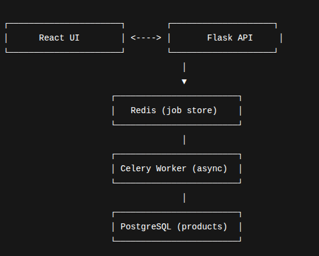

🚀 ACME Product Importer — README.md

A complete, scalable, production-grade web application that allows users to upload large CSV files (up to 500,000 products), process them asynchronously, manage products, configure webhooks, and track background jobs — built with Flask, Celery, Redis, PostgreSQL, Docker, and React.

📌 Live Demo

👉 Deployed URL: https://acme-product-importer-a2611d46.vercel.app/

📘 Table of Contents

- [Overview](#-overview)
- [Features](#-features)
- [Architecture](#-architecture)
- [Tech Stack](#-tech-stack)
- [Functional Requirements Coverage](#-functional-requirements-coverage)
- [How it Works](#-how-it-works)
- [API Endpoints](#-api-endpoints)
- [Webhook System](#-webhook-system)
- [Local Development](#-local-development)
- [Docker Deployment](#-docker-deployment)
- [Folder Structure](#-folder-structure)
- [Future Enhancements](#-future-enhancements)

🧩 Overview

ACME Product Importer is designed to efficiently ingest massive CSV files into a PostgreSQL database using chunked processing and asynchronous Celery workers.

The goal is to build a highly scalable, responsive, and real-world ready system capable of handling:

- Long-running uploads
- Real-time progress tracking
- Product CRUD UI
- Bulk delete
- Webhook processing
- Background task monitoring

This project satisfies all assignment requirements, and is deployed publicly for easy review.

🛠 Features

**✅ Large CSV File Upload (up to 500,000 rows)**
- Upload via UI
- CSV parsed in chunks (configurable CHUNK_SIZE)
- Duplicate SKUs are upserted (case-insensitive)
- SKU uniqueness enforced at DB level
- Automatic status updates

**✅ Real-Time Upload Progress (Story 1A)**
- Uses polling API (`/progress?job_id=`)
- Shows:
  - Percentage
  - Processed vs total records
  - Status messages ("parsing", "processing", "complete", etc.)
  - Error messages
- Continues tracking even if user refreshes page
- Full scheduled task history via `/scheduled-tasks`

**✅ Product Management UI (Story 2)**
- List all products
- Pagination
- Search by:
  - SKU
  - name
  - active status
  - description
- Create, update, delete products
- Clean minimal UI using shadcn/ui

**✅ Bulk Delete (Story 3)**
- Delete all products button
- Full-screen confirmation dialog
- Success and error notifications

**✅ Webhook System (Story 4)**
- Full UI to manage webhooks:
  - Add, edit, delete webhooks
  - Enable/Disable toggle
- Supports event types:
  - `product.created`
  - `product.updated`
  - `product.deleted`
  - `import.completed`
- Test webhook button (sends test payload + shows response)
- Non-blocking async webhook delivery in background worker

🧱 Architecture




⚙️ Tech Stack

**Backend**
- Python
- Flask
- Celery
- Redis
- SQLAlchemy ORM
- PostgreSQL

**Frontend**
- React + Vite
- shadcn/ui
- TypeScript
- TailwindCSS

**Deployment**
- Docker & Docker Compose
- Nginx reverse proxy
- Host bridge networking
- Public HTTPS-secured deployment

✔️ Functional Requirements Coverage

| Requirement | Status |
|-------------|--------|
| STORY 1 — CSV upload via UI | ✔️ Completed |
| Real-time progress indicator | ✔️ Completed |
| SKU uniqueness + overwrite | ✔️ Completed |
| Efficient large-file handling | ✔️ Completed |

| Requirement | Status |
|-------------|--------|
| STORY 2 — Progress updates | ✔️ Completed |
| Failure messages & retry | ✔️ Completed |
| Scheduled task list | ✔️ Completed |

| Requirement | Status |
|-------------|--------|
| STORY 3 — Product CRUD | ✔️ Completed |
| Filtering + pagination | ✔️ Completed |

| Requirement | Status |
|-------------|--------|
| STORY 4 — Bulk Delete | ✔️ Completed |
| Confirmation dialogs | ✔️ Completed |

| Requirement | Status |
|-------------|--------|
| STORY 5 — Webhook UI | ✔️ Completed |
| Add/edit/delete/test webhooks | ✔️ Completed |
| Async webhook delivery | ✔️ Completed |

| Requirement | Status |
|-------------|--------|
| Deployed publicly | ✔️ Completed |
| Clean commit history | ✔️ Completed |
| Infrastructure ready (Docker) | ✔️ Completed |
| Long-running tasks (Celery) | ✔️ Completed |

🔍 How It Works

**1. User uploads CSV**
- → API stores file
- → Creates job ID
- → Celery worker begins processing

**2. Worker processes CSV in chunks**
- → Validates SKU
- → Upserts into DB
- → Updates progress in Redis

**3. UI polls /progress**
- → Real-time progress bar updates

**4. When completed**
- → Products table updated
- → Webhook event `import.completed` triggered
- → File auto-deleted

***API Endpoints*** 

**CSV Import**
- `POST /upload`
- `GET /progress?job_id=123`
- `GET /scheduled-tasks`
- `POST /retry/{job_id}`

**Products**
- `GET /products`
- `POST /products`
- `PUT /products/{id}`
- `DELETE /products/{id}`
- `DELETE /products`

**Webhooks**
- `GET /webhooks`
- `POST /webhooks`
- `DELETE /webhooks/{id}`
- `POST /webhooks/{id}/toggle`
- `POST /webhooks/{id}/test`


***Webhook System***

**Events supported**
- `product.created`
- `product.updated`
- `product.deleted`
- `import.completed`

**Webhook delivery**
- Stored in PostgreSQL
- Processed async by Celery
- Retries on failure
- Test webhook endpoint for validation

🐳 Running Locally via Docker

```bash
docker-compose up --build -d
